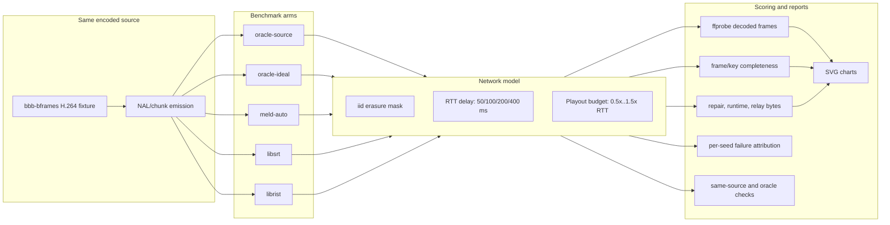
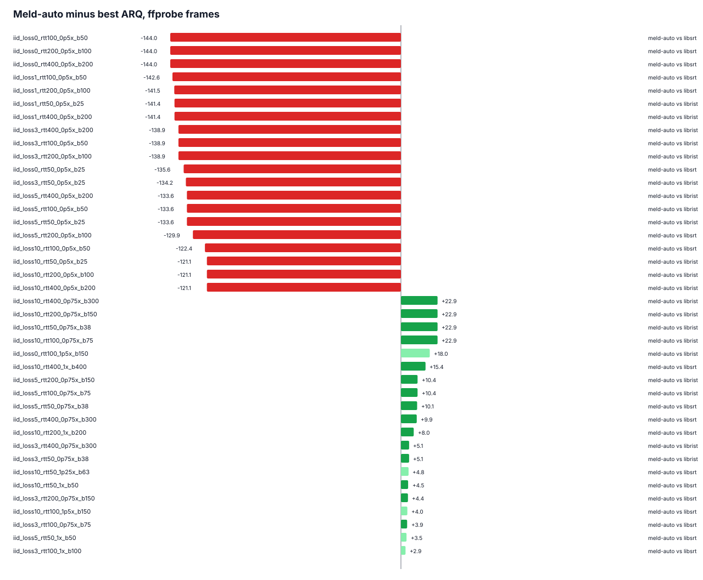
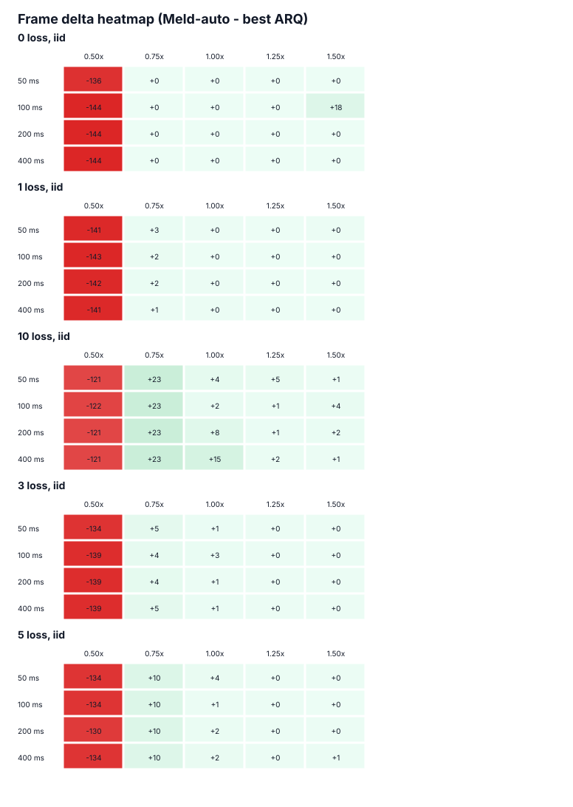
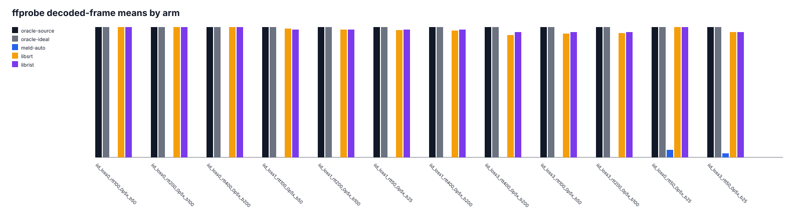
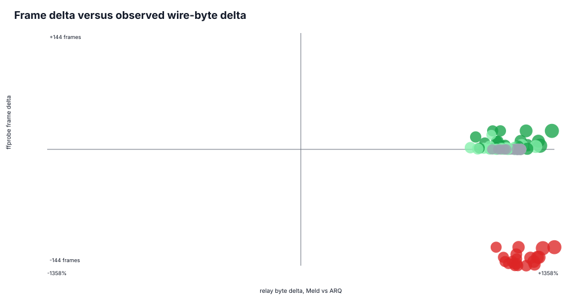
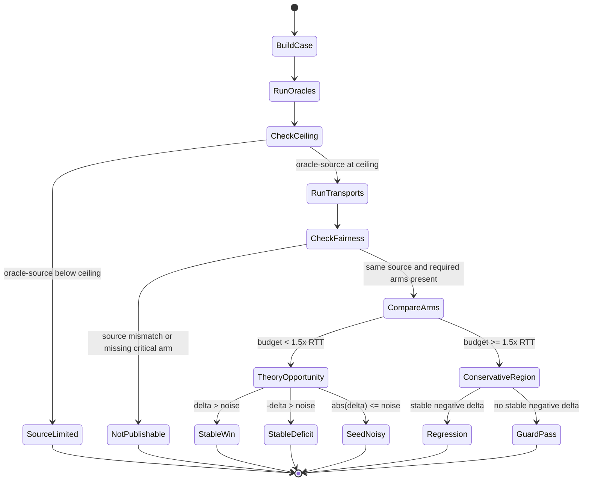
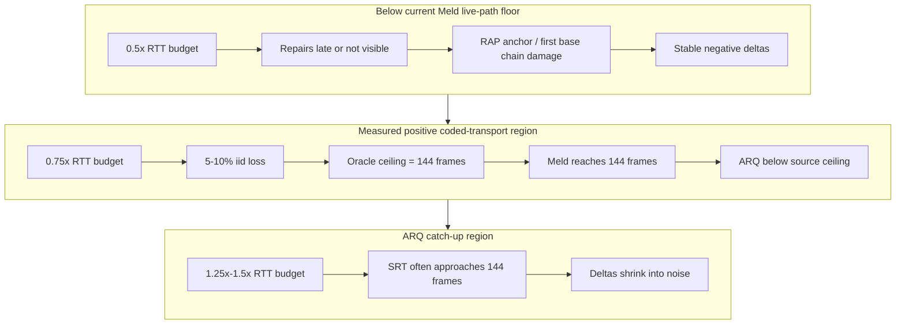
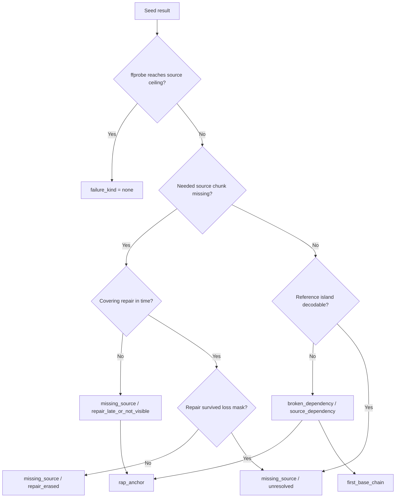
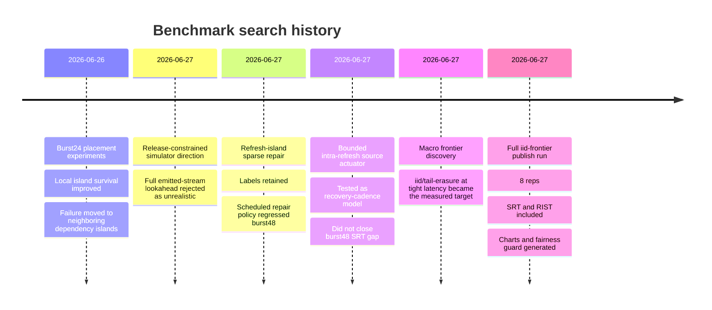
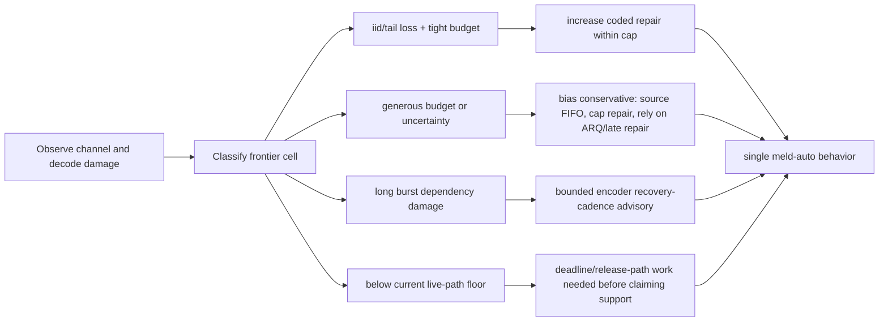

# Meld Benchmark Evidence

This document is the curated benchmark record for the current Meld transport
work. It replaces earlier benchmark notes with one aggregate view of what has
been measured, how it was measured, what the current data says, and where the
remaining gaps are.

The main dataset is the full 8-rep `iid-frontier` publication run completed on
2026-06-27:

```text
scratchpad/glassbench-results/publish-iid-frontier-reps8-20260627
```

The raw directory is intentionally under `scratchpad/` and should not be
committed. This document and the charts under `docs/bench-assets/` are the
commit-ready summary.

## Thesis Under Test

Meld is being evaluated as one deployable adaptive transport profile, not as a
set of hand-tuned benchmark profiles.

The specific protocol thesis tested here is:

- coded transport should have its clearest advantage when latency is below or
  near the time needed for ARQ-style retransmission;
- the primary positive frontier should be iid or tail-erasure loss with tight
  playout budgets;
- burst and long-outage cases should be included as boundary conditions, but
  they should not become local-placement tuning exercises unless macro data
  shows a stable target;
- Meld should expose one auto-adaptive behavior, not a matrix of deployable
  profiles;
- every claim must be judged against SRT and RIST using the same source stream,
  oracle rows, and explicit cost columns.

## Reading This Report

Terms used below:

| Term | Meaning |
| --- | --- |
| `Meld` | The deployable `meld-auto` arm. |
| `ARQ` | The better of `libsrt` and `librist` for a given cell. |
| `ff` | Mean `ffprobe` decoded frames across seeds. The source ceiling in this run is 144 frames. |
| `delta ff` | `meld-auto ff - best ARQ ff`. Positive means Meld decoded more frames. |
| `noise ff` | Combined sample standard deviation of the two arms being compared. |
| Stable | `abs(delta ff) > noise ff`. |
| Budget | Playout budget as a multiple of RTT. `0.75x` means the budget is less than one RTT. |
| Repair overhead | Meld repair packets divided by source packets. |
| Wire byte delta | Relay-observed forward bytes for Meld divided by the best ARQ arm, expressed as a multiplier in this document. |

The report is descriptive. It lays out the measured data and explains what each
field means. The data-driven conclusions are stated in measurement language:
where Meld has measured frame wins, where it has measured deficits, and where
the result is not stable.

## Measurement Model

`cmd/glassbench` drives source media through the candidate transports and scores
decoded media, not only packet delivery.



The 8-rep publish run uses:

| Field | Value |
| --- | --- |
| Suite | `iid-frontier` |
| Description | Primary low-latency iid/tail-erasure frontier where coded transport should beat ARQ below or near RTT. |
| Command | `go run ./cmd/glassbench -publishsuite iid-frontier -buf 0 -reps 8 -reportdir scratchpad/glassbench-results/publish-iid-frontier-reps8-20260627` |
| Arms | `oracle-source`, `oracle-ideal`, `meld-auto`, `libsrt`, `librist` |
| Losses | 0%, 1%, 3%, 5%, 10% iid |
| Burst length | 0 packets, meaning iid loss only |
| RTTs | 50, 100, 200, 400 ms |
| Latency budgets | 0.5x, 0.75x, 1.0x, 1.25x, 1.5x RTT |
| Reps | 8 seeds per cell |
| Source | `bbb-bframes` |
| Source clip | `internal/shape/testdata/bbb_bframes.h264` |
| Source ceiling | 144 `ffprobe` frames |
| Source packets | 341 |
| Source bytes | 60,613 |
| Go | `go1.26.3` |
| Platform | `darwin/arm64` |
| Git revision | `0576bbe`, dirty tree |
| FFmpeg/ffprobe | 8.1.1 |
| SRT | `srt-live-transmit`, SRT library 1.5.5 |
| RIST | local `librist` build tools |

The dirty tree marker matters. These are local research results from the current
working tree, not a release-tag reproduction.

## Publication Artifacts

The committed charts in this section are copied from the publication run.

| Artifact | Purpose |
| --- | --- |
| `frontier_rows.csv` | One aggregate row per case and arm. The run produced 500 rows. |
| `frontier_gaps.csv` | One `meld-auto` versus best-ARQ row per case. The run produced 100 rows. |
| `FRONTIER.md` | Sorted stable wins, deficits, noisy gaps, and frontier call. |
| `FAIRNESS.md` | Same-source, oracle, arm-presence, and conservative-region checks. |
| `failure_report.csv` | Per-seed first-failure attribution. |
| `failure_report.md` | Human-readable failure sample table. |
| `environment.json` | Command, toolchain, source, git, and tool versions. |
| `charts/*.svg` | Generated publication charts. |

## Chart Pack

### Meld Minus Best ARQ



This chart sorts cells by `delta ff`, where positive bars are frame-count wins
for Meld and negative bars are frame-count deficits. It makes two bands visible:
large negative 0.5x RTT cells and positive 0.75x RTT iid-loss cells.

### Frontier Heatmap



This chart lays out frame delta by RTT and latency budget. The 0.75x RTT cells
under 5% and 10% iid loss are the measured positive frontier. The 0.5x RTT cells
are the measured negative floor.

### Arm Frame Counts



This chart compares decoded-frame means for selected high-signal cases. It shows
Meld reaching the 144-frame source ceiling in the winning cells while SRT/RIST
remain below it.

### Cost Versus Gain



This chart places frame delta against observed byte and repair cost. It is the
main reason the frame wins should be presented as a cost/gain result rather than
as a free improvement.

## Benchmark State Machine

The suite classifies a case by physical opportunity, measurement stability, and
fairness status.



## Aggregate Run Counts

| Measure | Count |
| --- | ---: |
| Case cells | 100 |
| Arm rows | 500 |
| Meld-vs-best-ARQ gap rows | 100 |
| Theory-opportunity rows | 80 |
| Stable Meld wins | 22 |
| Stable Meld deficits | 20 |
| Seed-noisy or parity rows | 58 |
| Stable 0.5x RTT deficits | 20 |
| Stable 0.75x RTT wins | 13 |
| Stable 10% loss, 0.75x RTT wins | 4 |
| Stable 10% loss, 1.0x RTT wins | 4 |

Fairness guard:

| Check | Result |
| --- | ---: |
| Cases checked | 100 |
| Cases with missing required arms | 1 |
| Cases with source packet/byte mismatch | 0 |
| Cases where `oracle-source` missed the source ceiling | 0 |
| Stable conservative-region Meld regressions | 0 |

The missing arm was:

```text
iid_loss0_rtt100_1p5x_b150 libsrt FAILED (1/8)
```

Because the row is a zero-loss, generous-latency cell with a seed-noisy RIST
comparison, it is recorded as a fairness issue rather than used as a headline
claim.

## Frontier Summary

The publication run selected this positive target:

| Case | Meld arm | Best ARQ | Meld ff | ARQ ff | Delta ff | Noise ff | Stability |
| --- | --- | --- | ---: | ---: | ---: | ---: | --- |
| `iid_loss10_rtt100_0p75x_b75` | `meld-auto` | `librist` | 144.0 | 121.1 | +22.9 | 8.7 | stable |

Equivalent +22.9-frame stable wins appear at 10% iid loss, 0.75x RTT budget,
for RTT 50, 100, 200, and 400 ms.

The largest stable measured deficit is:

| Case | Meld arm | Best ARQ | Meld ff | ARQ ff | Delta ff | Noise ff | Stability |
| --- | --- | --- | ---: | ---: | ---: | ---: | --- |
| `iid_loss0_rtt400_0p5x_b200` | `meld-auto` | `libsrt` | 0.0 | 144.0 | -144.0 | 0.0 | stable |

The 0.5x RTT cells are therefore not part of the current Meld success region.
They are a hard floor in the current live path.

## Frontier Geometry



The measurement pattern is:

- at 0.5x RTT, Meld commonly decodes zero or near-zero frames while ARQ still
  decodes many frames;
- at 0.75x RTT, Meld reaches the source ceiling in the important iid-loss cells;
- at 1.0x RTT, Meld remains at ceiling and ARQ begins to catch up;
- at 1.25x and 1.5x RTT, most deltas are small or seed-noisy because ARQ has
  enough budget to recover.

## Delta By Loss And Budget

This table averages `delta ff` across RTTs for each loss and latency-budget
cell. It also counts stable wins, stable deficits, and noisy/parity rows.

| Loss | Budget | Mean delta ff | Stable wins | Stable deficits | Noisy |
| ---: | ---: | ---: | ---: | ---: | ---: |
| 0% | 0.50x | -141.9 | 0 | 4 | 0 |
| 0% | 0.75x | 0.0 | 0 | 0 | 0 |
| 0% | 1.00x | 0.0 | 0 | 0 | 0 |
| 0% | 1.25x | 0.0 | 0 | 0 | 0 |
| 0% | 1.50x | +4.5 | 0 | 0 | 1 |
| 1% | 0.50x | -141.7 | 0 | 4 | 0 |
| 1% | 0.75x | +2.0 | 1 | 0 | 3 |
| 1% | 1.00x | +0.2 | 0 | 0 | 3 |
| 1% | 1.25x | 0.0 | 0 | 0 | 0 |
| 1% | 1.50x | 0.0 | 0 | 0 | 1 |
| 3% | 0.50x | -137.7 | 0 | 4 | 0 |
| 3% | 0.75x | +4.6 | 4 | 0 | 0 |
| 3% | 1.00x | +1.4 | 2 | 0 | 2 |
| 3% | 1.25x | +0.2 | 0 | 0 | 4 |
| 3% | 1.50x | +0.2 | 0 | 0 | 4 |
| 5% | 0.50x | -132.7 | 0 | 4 | 0 |
| 5% | 0.75x | +10.2 | 4 | 0 | 0 |
| 5% | 1.00x | +2.2 | 1 | 0 | 3 |
| 5% | 1.25x | +0.2 | 0 | 0 | 4 |
| 5% | 1.50x | +0.4 | 0 | 0 | 3 |
| 10% | 0.50x | -121.4 | 0 | 4 | 0 |
| 10% | 0.75x | +22.9 | 4 | 0 | 0 |
| 10% | 1.00x | +7.6 | 4 | 0 | 0 |
| 10% | 1.25x | +2.4 | 1 | 0 | 3 |
| 10% | 1.50x | +1.8 | 1 | 0 | 3 |

The table says that the measured Meld advantage strengthens as iid loss rises
from 3% to 10% at 0.75x RTT, while 0.5x RTT remains negative for every loss.

## Stable Wins

These are the stable theory-opportunity wins called out by the generated
frontier report.

| Case | Best ARQ | Meld ff | ARQ ff | Delta ff | Noise ff | Repair overhead | Wire bytes |
| --- | --- | ---: | ---: | ---: | ---: | ---: | ---: |
| `iid_loss10_rtt100_0p75x_b75` | `librist` | 144.0 | 121.1 | +22.9 | 8.7 | +108.5% | 12.1x |
| `iid_loss10_rtt400_0p75x_b300` | `librist` | 144.0 | 121.1 | +22.9 | 8.7 | +86.7% | 10.3x |
| `iid_loss10_rtt200_0p75x_b150` | `librist` | 144.0 | 121.1 | +22.9 | 8.7 | +87.6% | 10.7x |
| `iid_loss10_rtt50_0p75x_b38` | `librist` | 144.0 | 121.1 | +22.9 | 8.7 | +126.0% | 13.4x |
| `iid_loss10_rtt400_1x_b400` | `libsrt` | 144.0 | 128.6 | +15.4 | 8.0 | +89.0% | 9.4x |
| `iid_loss5_rtt100_0p75x_b75` | `librist` | 144.0 | 133.6 | +10.4 | 6.3 | +99.2% | 11.8x |
| `iid_loss5_rtt200_0p75x_b150` | `librist` | 144.0 | 133.6 | +10.4 | 6.3 | +80.4% | 10.6x |
| `iid_loss5_rtt50_0p75x_b38` | `libsrt` | 144.0 | 133.9 | +10.1 | 6.1 | +110.9% | 12.7x |

What the columns mean:

- the decoded-frame win is stable because `delta ff` is larger than `noise ff`;
- the source packet and byte counts match between Meld and ARQ in these rows;
- the cost columns are high, so these are not zero-cost wins;
- the best ARQ arm changes by cell: RIST is often the best comparator at 0.75x,
  while SRT is often best around 1.0x and higher.

## Stable Deficits

These are the largest stable theory-opportunity deficits. They are all 0.5x RTT
cells in the current report.

| Case | Best ARQ | Meld ff | ARQ ff | Delta ff | Noise ff | Repair overhead | Wire bytes |
| --- | --- | ---: | ---: | ---: | ---: | ---: | ---: |
| `iid_loss0_rtt400_0p5x_b200` | `libsrt` | 0.0 | 144.0 | -144.0 | 0.0 | +85.6% | 11.6x |
| `iid_loss0_rtt200_0p5x_b100` | `libsrt` | 0.0 | 144.0 | -144.0 | 0.0 | +82.9% | 11.5x |
| `iid_loss0_rtt100_0p5x_b50` | `libsrt` | 0.0 | 144.0 | -144.0 | 0.0 | +91.8% | 12.1x |
| `iid_loss1_rtt100_0p5x_b50` | `libsrt` | 0.0 | 142.6 | -142.6 | 0.9 | +100.0% | 12.5x |
| `iid_loss1_rtt200_0p5x_b100` | `libsrt` | 0.0 | 141.5 | -141.5 | 3.5 | +85.8% | 11.6x |
| `iid_loss1_rtt50_0p5x_b25` | `librist` | 0.0 | 141.4 | -141.4 | 4.7 | +89.1% | 11.4x |
| `iid_loss1_rtt400_0p5x_b200` | `librist` | 0.0 | 141.4 | -141.4 | 4.7 | +85.3% | 11.1x |
| `iid_loss3_rtt200_0p5x_b100` | `librist` | 0.0 | 138.9 | -138.9 | 4.7 | +90.5% | 11.3x |

What the columns mean:

- the 0.5x RTT budget is below the current Meld live release/recovery floor;
- the oracle rows still reach 144 frames, so the benchmark source itself is not
  impossible in these cells;
- the issue is not that Meld spends too little wire cost in these rows, because
  the observed wire cost is still much higher than ARQ.

## Failure Attribution

`failure_report.csv` records the first damaged dependency island for each seed
and arm. Across all arms and seeds:

| Failure kind | Count |
| --- | ---: |
| `none` | 2785 |
| `broken_dependency` | 1008 |
| `missing_source` | 206 |

| Failure cause | Count |
| --- | ---: |
| `none` | 2785 |
| `source_dependency` | 1008 |
| `source_loss_no_repair` | 147 |
| `repair_late_or_not_visible` | 59 |

| Dependency island | Count |
| --- | ---: |
| `none` | 2785 |
| `first_base_chain` | 659 |
| `rap_anchor` | 410 |
| `disposable_source` | 145 |

For `meld-auto` specifically:

| Failure kind | Cause | Dependency island | Meld-auto seed rows |
| --- | --- | --- | ---: |
| `none` | `none` | `none` | 639 |
| `missing_source` | `repair_late_or_not_visible` | `rap_anchor` | 59 |
| `broken_dependency` | `source_dependency` | `first_base_chain` | 82 |
| `broken_dependency` | `source_dependency` | `rap_anchor` | 20 |

Additional Meld failure counters:

| Counter | Rows |
| --- | ---: |
| Meld failure rows | 161 |
| Failure rows with repair in time | 1 |
| Failure rows with repair dropped | 1 |
| Failure rows with repair survived | 1 |
| Failure rows where repair was erased | 0 |
| Failure rows with source dependency cause | 102 |

The failure report separates three situations:

- no failure: all dependencies needed by the decoder arrived and decoded;
- repair-late or not-visible: source was missing and usable repair was not
  available before the deadline;
- source dependency: a later unit was present, but a dependency island it needed
  was not decodable.



The dominant named islands are RAP anchor and first base chain. That is why the
burst/source-structure work below matters even though it did not produce the
current positive frontier.

## Cost Columns

The positive frame-count results come with high cost in the current run.

At the strongest 10% iid, 0.75x RTT cells:

| RTT | Budget | Meld ff | Best ARQ | ARQ ff | Delta ff | Repair overhead | Wire bytes |
| ---: | ---: | ---: | --- | ---: | ---: | ---: | ---: |
| 50 ms | 38 ms | 144.0 | `librist` | 121.1 | +22.9 | +126.0% | 13.4x |
| 100 ms | 75 ms | 144.0 | `librist` | 121.1 | +22.9 | +108.5% | 12.1x |
| 200 ms | 150 ms | 144.0 | `librist` | 121.1 | +22.9 | +87.6% | 10.7x |
| 400 ms | 300 ms | 144.0 | `librist` | 121.1 | +22.9 | +86.7% | 10.3x |

These columns mean:

- Meld spends roughly 0.87 to 1.26 repair packets per source packet in these
  headline cells;
- relay-observed forward bytes are roughly 10x to 13x the best ARQ arm;
- the decoded-frame gain is real in the measurement, but the current cost
  envelope is not yet publication-friendly unless the claim is explicitly a
  cost/gain tradeoff.

CPU/RSS caveat: SRT and RIST are subprocesses, so external-process CPU/RSS is
captured for them. Meld runs in-process inside `glassbench`, so this benchmark
does not yet provide a defensible Meld-vs-SRT-vs-RIST CPU/RSS comparison.

## Full Gap Matrix

This table is the full 100-row `meld-auto` versus best-ARQ gap matrix from the
8-rep run, sorted by the generated frontier report.

| Loss | RTT | Budget | Budget ms | Meld ff | Best ARQ | ARQ ff | Delta ff | Noise ff | Stable | Repair overhead | Wire bytes |
| ---: | ---: | ---: | ---: | ---: | --- | ---: | ---: | ---: | --- | ---: | ---: |
| 10% | 100 | 0.75x | 75 | 144.0 | `librist` | 121.1 | +22.9 | 8.7 | true | +108.5% | 12.1x |
| 10% | 400 | 0.75x | 300 | 144.0 | `librist` | 121.1 | +22.9 | 8.7 | true | +86.7% | 10.3x |
| 10% | 200 | 0.75x | 150 | 144.0 | `librist` | 121.1 | +22.9 | 8.7 | true | +87.6% | 10.7x |
| 10% | 50 | 0.75x | 38 | 144.0 | `librist` | 121.1 | +22.9 | 8.7 | true | +126.0% | 13.4x |
| 10% | 400 | 1.00x | 400 | 144.0 | `libsrt` | 128.6 | +15.4 | 8.0 | true | +89.0% | 9.4x |
| 5% | 100 | 0.75x | 75 | 144.0 | `librist` | 133.6 | +10.4 | 6.3 | true | +99.2% | 11.8x |
| 5% | 200 | 0.75x | 150 | 144.0 | `librist` | 133.6 | +10.4 | 6.3 | true | +80.4% | 10.6x |
| 5% | 50 | 0.75x | 38 | 144.0 | `libsrt` | 133.9 | +10.1 | 6.1 | true | +110.9% | 12.7x |
| 5% | 400 | 0.75x | 300 | 144.0 | `libsrt` | 134.1 | +9.9 | 6.5 | true | +86.1% | 10.5x |
| 10% | 200 | 1.00x | 200 | 144.0 | `libsrt` | 136.0 | +8.0 | 6.3 | true | +85.8% | 9.9x |
| 3% | 400 | 0.75x | 300 | 144.0 | `librist` | 138.9 | +5.1 | 4.7 | true | +85.6% | 10.9x |
| 3% | 50 | 0.75x | 38 | 144.0 | `librist` | 138.9 | +5.1 | 4.7 | true | +101.9% | 12.1x |
| 10% | 50 | 1.25x | 63 | 144.0 | `libsrt` | 139.2 | +4.8 | 4.8 | false | +110.4% | 11.8x |
| 10% | 50 | 1.00x | 50 | 144.0 | `libsrt` | 139.5 | +4.5 | 4.1 | true | +126.1% | 12.8x |
| 3% | 200 | 0.75x | 150 | 144.0 | `libsrt` | 139.6 | +4.4 | 2.6 | true | +78.6% | 10.8x |
| 3% | 100 | 0.75x | 75 | 144.0 | `libsrt` | 140.1 | +3.9 | 2.4 | true | +90.9% | 11.6x |
| 5% | 50 | 1.00x | 50 | 144.0 | `libsrt` | 140.5 | +3.5 | 4.5 | false | +110.6% | 12.6x |
| 3% | 100 | 1.00x | 100 | 143.8 | `libsrt` | 140.9 | +2.9 | 3.7 | false | +77.7% | 10.7x |
| 1% | 50 | 0.75x | 38 | 144.0 | `librist` | 141.4 | +2.6 | 4.7 | false | +89.8% | 11.5x |
| 1% | 200 | 0.75x | 150 | 144.0 | `libsrt` | 141.5 | +2.5 | 3.3 | false | +76.8% | 11.0x |
| 10% | 100 | 1.00x | 100 | 144.0 | `libsrt` | 141.5 | +2.5 | 1.6 | true | +93.8% | 10.7x |
| 5% | 200 | 1.00x | 200 | 144.0 | `libsrt` | 141.8 | +2.2 | 4.0 | false | +77.9% | 10.3x |
| 10% | 400 | 1.25x | 500 | 144.0 | `libsrt` | 141.9 | +2.1 | 3.3 | false | +89.9% | 9.1x |
| 5% | 400 | 1.00x | 400 | 144.0 | `libsrt` | 142.0 | +2.0 | 1.5 | true | +87.9% | 10.4x |
| 1% | 100 | 0.75x | 75 | 144.0 | `libsrt` | 142.1 | +1.9 | 1.1 | true | +86.1% | 11.6x |
| 10% | 200 | 1.25x | 250 | 144.0 | `libsrt` | 142.6 | +1.4 | 1.4 | false | +86.4% | 9.8x |
| 3% | 400 | 1.00x | 400 | 144.0 | `libsrt` | 142.8 | +1.2 | 1.7 | false | +87.8% | 11.0x |
| 10% | 100 | 1.25x | 125 | 144.0 | `libsrt` | 142.8 | +1.2 | 1.0 | true | +88.4% | 10.3x |
| 1% | 400 | 0.75x | 300 | 144.0 | `libsrt` | 143.1 | +0.9 | 1.1 | false | +85.3% | 11.4x |
| 5% | 100 | 1.00x | 100 | 144.0 | `libsrt` | 143.1 | +0.9 | 1.2 | false | +81.6% | 10.7x |
| 3% | 50 | 1.00x | 50 | 144.0 | `libsrt` | 143.2 | +0.8 | 0.7 | true | +99.6% | 12.1x |
| 3% | 200 | 1.00x | 200 | 144.0 | `libsrt` | 143.4 | +0.6 | 0.5 | true | +77.2% | 10.5x |
| 1% | 200 | 1.00x | 200 | 144.0 | `libsrt` | 143.5 | +0.5 | 0.8 | false | +75.8% | 10.9x |
| 3% | 50 | 1.25x | 63 | 144.0 | `libsrt` | 143.5 | +0.5 | 1.4 | false | +89.3% | 11.4x |
| 5% | 200 | 1.25x | 250 | 144.0 | `libsrt` | 143.8 | +0.2 | 0.5 | false | +77.7% | 10.1x |
| 5% | 50 | 1.25x | 63 | 144.0 | `libsrt` | 143.8 | +0.2 | 0.5 | false | +94.7% | 11.5x |
| 5% | 100 | 1.25x | 125 | 144.0 | `libsrt` | 143.8 | +0.2 | 0.5 | false | +77.7% | 10.3x |
| 3% | 100 | 1.25x | 125 | 144.0 | `libsrt` | 143.9 | +0.1 | 0.4 | false | +74.1% | 10.5x |
| 1% | 50 | 1.00x | 50 | 144.0 | `libsrt` | 143.9 | +0.1 | 0.4 | false | +89.1% | 11.8x |
| 3% | 200 | 1.25x | 250 | 144.0 | `libsrt` | 143.9 | +0.1 | 0.4 | false | +76.6% | 10.4x |
| 5% | 400 | 1.25x | 500 | 144.0 | `libsrt` | 143.9 | +0.1 | 0.4 | false | +89.0% | 10.5x |
| 3% | 400 | 1.25x | 500 | 144.0 | `libsrt` | 143.9 | +0.1 | 0.4 | false | +89.2% | 11.1x |
| 1% | 400 | 1.00x | 400 | 144.0 | `libsrt` | 143.9 | +0.1 | 0.4 | false | +87.3% | 11.6x |
| 0% | 50 | 0.75x | 38 | 144.0 | `libsrt` | 144.0 | 0.0 | 0.0 | true | +82.8% | 11.5x |
| 0% | 200 | 1.00x | 200 | 144.0 | `libsrt` | 144.0 | 0.0 | 0.0 | true | +75.3% | 11.0x |
| 0% | 200 | 0.75x | 150 | 144.0 | `libsrt` | 144.0 | 0.0 | 0.0 | true | +76.6% | 11.0x |
| 1% | 100 | 1.25x | 125 | 144.0 | `libsrt` | 144.0 | 0.0 | 0.0 | true | +71.6% | 10.6x |
| 1% | 100 | 1.00x | 100 | 144.0 | `libsrt` | 144.0 | 0.0 | 0.0 | true | +73.9% | 10.7x |
| 0% | 200 | 1.25x | 250 | 144.0 | `libsrt` | 144.0 | 0.0 | 0.0 | true | +75.6% | 11.0x |
| 0% | 400 | 0.75x | 300 | 144.0 | `libsrt` | 144.0 | 0.0 | 0.0 | true | +85.3% | 11.6x |
| 0% | 400 | 1.25x | 500 | 144.0 | `libsrt` | 144.0 | 0.0 | 0.0 | true | +87.9% | 11.8x |
| 0% | 100 | 0.75x | 75 | 144.0 | `libsrt` | 144.0 | 0.0 | 0.0 | true | +78.4% | 11.2x |
| 1% | 200 | 1.25x | 250 | 144.0 | `libsrt` | 144.0 | 0.0 | 0.0 | true | +76.0% | 10.9x |
| 0% | 50 | 1.25x | 63 | 144.0 | `libsrt` | 144.0 | 0.0 | 0.0 | true | +76.3% | 11.0x |
| 0% | 400 | 1.00x | 400 | 144.0 | `libsrt` | 144.0 | 0.0 | 0.0 | true | +87.0% | 11.7x |
| 1% | 400 | 1.25x | 500 | 144.0 | `libsrt` | 144.0 | 0.0 | 0.0 | true | +88.2% | 11.6x |
| 0% | 100 | 1.25x | 125 | 144.0 | `libsrt` | 144.0 | 0.0 | 0.0 | true | +71.2% | 10.7x |
| 0% | 50 | 1.00x | 50 | 144.0 | `libsrt` | 144.0 | 0.0 | 0.0 | true | +82.5% | 11.4x |
| 0% | 100 | 1.00x | 100 | 144.0 | `libsrt` | 144.0 | 0.0 | 0.0 | true | +72.7% | 10.8x |
| 1% | 50 | 1.25x | 63 | 144.0 | `libsrt` | 144.0 | 0.0 | 0.0 | true | +81.2% | 11.3x |
| 10% | 400 | 0.50x | 200 | 0.0 | `librist` | 121.1 | -121.1 | 8.7 | true | +85.2% | 10.5x |
| 10% | 200 | 0.50x | 100 | 0.0 | `librist` | 121.1 | -121.1 | 8.7 | true | +102.0% | 11.7x |
| 10% | 50 | 0.50x | 25 | 0.0 | `librist` | 121.1 | -121.1 | 8.7 | true | +125.3% | 13.6x |
| 10% | 100 | 0.50x | 50 | 0.0 | `libsrt` | 122.4 | -122.4 | 10.0 | true | +125.6% | 13.0x |
| 5% | 200 | 0.50x | 100 | 4.5 | `libsrt` | 134.4 | -129.9 | 15.8 | true | +94.1% | 11.5x |
| 5% | 50 | 0.50x | 25 | 0.0 | `librist` | 133.6 | -133.6 | 6.3 | true | +108.5% | 12.7x |
| 5% | 100 | 0.50x | 50 | 0.0 | `librist` | 133.6 | -133.6 | 6.3 | true | +112.4% | 12.8x |
| 5% | 400 | 0.50x | 200 | 0.0 | `librist` | 133.6 | -133.6 | 6.3 | true | +85.2% | 10.9x |
| 3% | 50 | 0.50x | 25 | 4.6 | `librist` | 138.9 | -134.2 | 13.9 | true | +102.4% | 12.3x |
| 0% | 50 | 0.50x | 25 | 8.4 | `libsrt` | 144.0 | -135.6 | 15.9 | true | +84.3% | 11.6x |
| 3% | 200 | 0.50x | 100 | 0.0 | `librist` | 138.9 | -138.9 | 4.7 | true | +90.5% | 11.3x |
| 3% | 100 | 0.50x | 50 | 0.0 | `librist` | 138.9 | -138.9 | 4.7 | true | +107.4% | 12.5x |
| 3% | 400 | 0.50x | 200 | 0.0 | `librist` | 138.9 | -138.9 | 4.7 | true | +85.3% | 10.9x |
| 1% | 50 | 0.50x | 25 | 0.0 | `librist` | 141.4 | -141.4 | 4.7 | true | +89.1% | 11.4x |
| 1% | 400 | 0.50x | 200 | 0.0 | `librist` | 141.4 | -141.4 | 4.7 | true | +85.3% | 11.1x |
| 1% | 200 | 0.50x | 100 | 0.0 | `libsrt` | 141.5 | -141.5 | 3.5 | true | +85.8% | 11.6x |
| 1% | 100 | 0.50x | 50 | 0.0 | `libsrt` | 142.6 | -142.6 | 0.9 | true | +100.0% | 12.5x |
| 0% | 100 | 0.50x | 50 | 0.0 | `libsrt` | 144.0 | -144.0 | 0.0 | true | +91.8% | 12.1x |
| 0% | 200 | 0.50x | 100 | 0.0 | `libsrt` | 144.0 | -144.0 | 0.0 | true | +82.9% | 11.5x |
| 0% | 400 | 0.50x | 200 | 0.0 | `libsrt` | 144.0 | -144.0 | 0.0 | true | +85.6% | 11.6x |
| 0% | 100 | 1.50x | 150 | 144.0 | `librist` | 126.0 | +18.0 | 50.9 | false | +70.2% | 10.2x |
| 10% | 100 | 1.50x | 150 | 144.0 | `libsrt` | 140.0 | +4.0 | 4.4 | false | +83.8% | 10.1x |
| 10% | 200 | 1.50x | 300 | 144.0 | `libsrt` | 142.5 | +1.5 | 1.2 | true | +83.9% | 9.6x |
| 10% | 50 | 1.50x | 75 | 144.0 | `libsrt` | 142.9 | +1.1 | 1.7 | false | +97.7% | 11.1x |
| 5% | 400 | 1.50x | 600 | 144.0 | `librist` | 143.1 | +0.9 | 1.1 | false | +89.1% | 10.8x |
| 10% | 400 | 1.50x | 600 | 144.0 | `libsrt` | 143.4 | +0.6 | 0.7 | false | +89.7% | 9.5x |
| 5% | 50 | 1.50x | 75 | 144.0 | `libsrt` | 143.6 | +0.4 | 0.7 | false | +86.0% | 10.9x |
| 3% | 100 | 1.50x | 150 | 144.0 | `libsrt` | 143.8 | +0.2 | 0.5 | false | +73.6% | 10.4x |
| 3% | 200 | 1.50x | 300 | 144.0 | `libsrt` | 143.8 | +0.2 | 0.5 | false | +77.5% | 10.6x |
| 5% | 200 | 1.50x | 300 | 144.0 | `libsrt` | 143.8 | +0.2 | 0.5 | false | +78.1% | 10.1x |
| 3% | 50 | 1.50x | 75 | 144.0 | `libsrt` | 143.9 | +0.1 | 0.4 | false | +79.1% | 10.8x |
| 3% | 400 | 1.50x | 600 | 144.0 | `libsrt` | 143.9 | +0.1 | 0.4 | false | +88.8% | 11.1x |
| 1% | 50 | 1.50x | 75 | 144.0 | `libsrt` | 143.9 | +0.1 | 0.4 | false | +75.2% | 10.8x |
| 0% | 50 | 1.50x | 75 | 144.0 | `libsrt` | 144.0 | 0.0 | 0.0 | true | +71.5% | 10.7x |
| 0% | 400 | 1.50x | 600 | 144.0 | `libsrt` | 144.0 | 0.0 | 0.0 | true | +87.8% | 11.8x |
| 0% | 200 | 1.50x | 300 | 144.0 | `libsrt` | 144.0 | 0.0 | 0.0 | true | +76.0% | 11.0x |
| 1% | 200 | 1.50x | 300 | 144.0 | `libsrt` | 144.0 | 0.0 | 0.0 | true | +76.4% | 10.9x |
| 1% | 100 | 1.50x | 150 | 144.0 | `libsrt` | 144.0 | 0.0 | 0.0 | true | +71.2% | 10.6x |
| 5% | 100 | 1.50x | 150 | 144.0 | `libsrt` | 144.0 | 0.0 | 0.0 | true | +74.8% | 10.3x |
| 1% | 400 | 1.50x | 600 | 144.0 | `libsrt` | 144.0 | 0.0 | 0.0 | true | +88.3% | 11.6x |

## Earlier Discovery Run

Before the full publish run, a 3-rep discovery run covered iid, burst48, and
burst96:

```text
scratchpad/glassbench-results/frontier-discovery-samesource-oracles-reps3-20260627
```

Grid:

| Field | Value |
| --- | --- |
| Arms | `oracle-source`, `oracle-ideal`, `meld-auto`, `meld-repair-ceiling`, `libsrt` |
| Losses | 5%, 10% |
| Burst lengths | 0, 48, 96 packets |
| RTTs | 50, 100, 200 ms |
| Budgets | 0.75x, 1.0x, 1.5x RTT |
| Reps | 3 |

The discovery run selected the same kind of target:

| Case | Meld ff | SRT ff | Delta ff | Noise ff | Stability |
| --- | ---: | ---: | ---: | ---: | --- |
| `iid_loss10_rtt100_0p75x_b75` | 144.0 | 113.7 | +30.3 | 23.0 | stable |
| `iid_loss10_rtt200_0p75x_b150` | 144.0 | 118.7 | +25.3 | 3.1 | stable |
| `iid_loss10_rtt50_0p75x_b38` | 144.0 | 120.3 | +23.7 | 18.7 | stable |
| `iid_loss5_rtt200_0p75x_b150` | 144.0 | 130.3 | +13.7 | 1.5 | stable |
| `iid_loss5_rtt100_0p75x_b75` | 144.0 | 131.7 | +12.3 | 6.7 | stable |

Burst48 and burst96 did not produce a stable positive target in that discovery
run. Their largest raw gaps were mostly seed-noisy. The discovery result is why
the 8-rep publish run narrowed onto iid/tail-erasure.

## Burst48 And Source-Structure Ledger

Several rejected lines of work are preserved because they explain why the
current document does not center burst48 placement or refresh-island repair.



### Refresh-Island Sparse Repair

Comparable burst48 runs showed refresh-island sparse repair regressing Meld in
every listed burst48 frontier cell.

| Cell | Old ff | New ff | Delta ff | Reactive delta | Repair delta |
| --- | ---: | ---: | ---: | ---: | ---: |
| `burst48_loss5_rtt50_1x_b50` | 124.250 | 120.750 | -3.500 | +59.500 | -1.500 |
| `burst48_loss5_rtt50_1p5x_b75` | 126.000 | 123.000 | -3.000 | +60.625 | -3.375 |
| `burst48_loss5_rtt100_1x_b100` | 125.375 | 124.500 | -0.875 | +61.125 | +3.625 |
| `burst48_loss5_rtt100_1p5x_b150` | 127.000 | 122.875 | -4.125 | +60.875 | +2.875 |
| `burst48_loss10_rtt50_1x_b50` | 122.000 | 114.750 | -7.250 | +67.750 | +19.375 |
| `burst48_loss10_rtt50_1p5x_b75` | 123.625 | 119.250 | -4.375 | +65.500 | +7.750 |
| `burst48_loss10_rtt100_1x_b100` | 121.750 | 120.750 | -1.000 | +62.750 | -0.750 |
| `burst48_loss10_rtt100_1p5x_b150` | 125.125 | 122.000 | -3.125 | +62.375 | +3.500 |

The retained result is metadata only: recovery-refresh labels remain useful for
failure attribution, but scheduled whole-refresh-island repair is not part of
the default deployable `meld-auto` policy.

### Burst48 Source-Structure Thesis Test

The source-structure thesis test asked whether bounded recovery cadence or
intra-refresh could close the burst48 low-latency SRT gap under a fixed repair
budget.

| Variant | Avg gap vs SRT | Avg delta vs baseline | Avg repair delta vs baseline | Cells better than baseline |
| --- | ---: | ---: | ---: | ---: |
| Baseline source | -14.8 ff | 0.0 ff | 0.0 | 8/8 best |
| IR12 | -20.7 ff | -5.9 ff | -128.2 | 0/8 |
| IR24 | -20.2 ff | -5.5 ff | -171.7 | 0/8 |
| IR48 | -19.5 ff | -4.8 ff | -202.0 | 0/8 |
| IR48, tighter target | -18.8 ff | -4.1 ff | -101.7 | 0/8 |
| IR48, red 0.20 + target 1e-12 | -17.5 ff | -2.7 ff | +45.6 | 1/8 |

This table says the bounded x264 intra-refresh model changed which dependency
island failed, but did not create a macro frame-count gain under the tested
budget.

## Deployable Control Boundary

The benchmark and docs should describe one adaptive deployable profile:
`meld-auto`.



The benchmark data supports this boundary:

- no separate deployable profiles are needed to describe the measured iid win;
- rejected burst48 placement and refresh-island repair options should remain out
  of the deployable surface;
- encoder recovery-cadence controls are advisory and bounded, not a separate
  profile;
- the 0.5x RTT floor should be represented as an unsupported or not-yet-solved
  region until the live path changes.

## What The Data Means

The data currently says:

| Observation | Meaning |
| --- | --- |
| Meld reaches 144 frames in the 5-10% iid, 0.75x RTT region. | Coded proactive recovery is doing useful work before ARQ can fully recover. |
| SRT/RIST approach 144 frames at larger budgets. | Once ARQ has enough time, Meld's frame-count advantage shrinks or disappears. |
| Meld collapses at 0.5x RTT even with no loss. | The current live release/recovery path has a deadline floor below which it is not usable. |
| Oracle rows reach 144 frames in the main cells. | The source and benchmark are not the limiting factor in the main iid frontier cells. |
| Failure attribution points to RAP anchor and first base chain islands. | Decode dependencies, not just packet counts, determine whether a packet-loss event becomes visible media damage. |
| Repair and wire-byte cost are high in winning cells. | Publication claims must include cost/gain, not just frame-count advantage. |
| Burst48 source/repair experiments did not move the macro frontier. | More burst48 placement tuning is not justified by the current evidence. |

## Constraints On Publication Claims

Defensible claims from this dataset:

- same-source iid/tail-erasure cells were run with SRT and RIST comparators;
- oracle rows reached the source ceiling;
- 10% iid loss at 0.75x RTT produced stable +22.9-frame Meld wins across RTT
  50, 100, 200, and 400 ms;
- 5% iid loss at 0.75x RTT produced stable roughly +10-frame wins across the RTT
  set;
- no stable conservative-region Meld regressions were found by the fairness
  guard;
- the current implementation has a stable 0.5x RTT deficit.

Claims that are not supported yet:

- "Meld is always better than SRT/RIST";
- "Meld is deployable at 0.5x RTT";
- "Meld has lower CPU or RSS";
- "Meld has lower wire cost";
- "burst48/long-outage behavior is solved";
- "bounded intra-refresh is a proven macro actuator";
- "refresh-island sparse repair is a deployable improvement".

## Reproduction Commands

Primary publish run:

```sh
go run ./cmd/glassbench -publishsuite iid-frontier -buf 0 -reps 8 \
  -reportdir scratchpad/glassbench-results/publish-iid-frontier-reps8-20260627
```

Equivalent fresh run:

```sh
go run ./cmd/glassbench -publishsuite iid-frontier -buf 0 -reps 8 \
  -reportdir scratchpad/glassbench-results/publish-iid-frontier-$(date +%Y%m%d)
```

Discovery run shape:

```sh
go run ./cmd/glassbench -macrofrontier -buf 0 \
  -arms oracle-source,oracle-ideal,meld-auto,meld-repair-ceiling,libsrt \
  -frontierlosses 0.05,0.10 \
  -frontierbursts 0,48,96 \
  -rtts 50,100,200 \
  -frontiermults 0.75,1,1.5 \
  -reps 3 \
  -reportdir scratchpad/glassbench-results/frontier-discovery
```

Focused iid confirmation shape:

```sh
go run ./cmd/glassbench -macrofrontier -buf 0 \
  -arms oracle-source,oracle-ideal,meld-auto,libsrt,librist \
  -frontierlosses 0.05,0.10 \
  -frontierbursts 0 \
  -rtts 50,100,200 \
  -frontiermults 0.75,1,1.5 \
  -reps 8 \
  -reportdir scratchpad/glassbench-results/frontier-iid-confirm
```

## Next Measurement Work

The next work is measurement cleanup and envelope confirmation, not another
burst-placement pass.

1. Reduce the cost of the iid/tail-erasure win and rerun the same `iid-frontier`
   suite. The gate is movement in `frontier_gaps.csv` and `cost-gain.svg`, not a
   local repair metric.
2. Add an isolated Meld process runner so CPU/RSS can be compared with SRT/RIST.
3. Add a second and third source family to the publish suite so the iid frontier
   is not tied to one dependency graph.
4. Add a regression gate for the 10% iid, 0.75x RTT cells and for the 0.5x RTT
   deficit cells.
5. Treat burst48/burst96 as boundary-condition discovery unless a future macro
   run shows stable opportunity under the same source and budget.

## Related Decision Notes

- [Macro frontier discovery](decisions/2026-06-27-macro-frontier-discovery.md)
- [Refresh-island sparse repair](decisions/2026-06-27-refresh-island-repair.md)
- [Burst48 source-structure thesis](decisions/2026-06-27-burst48-source-thesis.md)
- [Cleanup after macro frontier discovery](decisions/2026-06-27-cleanup-after-frontier.md)
- [Publish benchmark battery](decisions/2026-06-27-publish-benchmark-battery.md)
